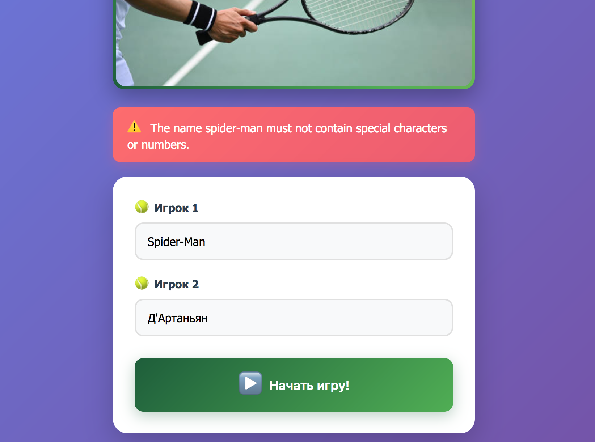
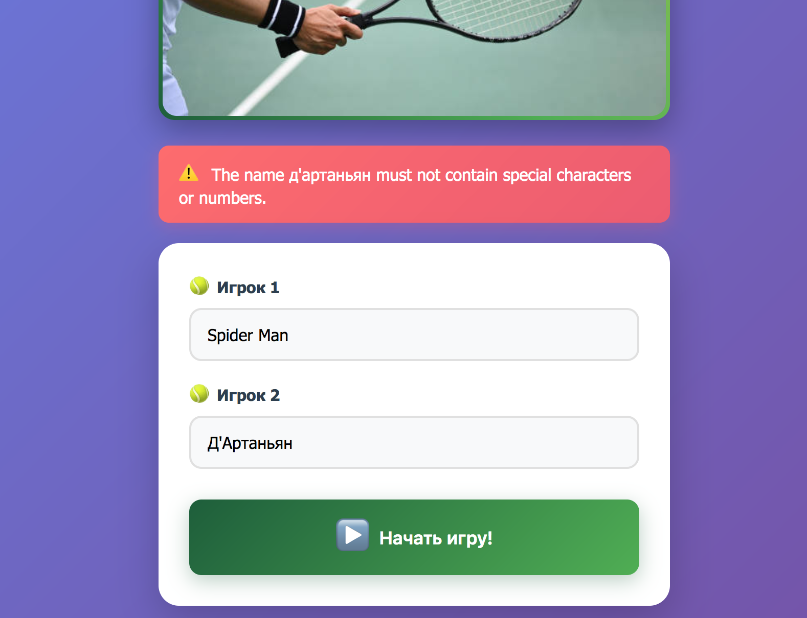
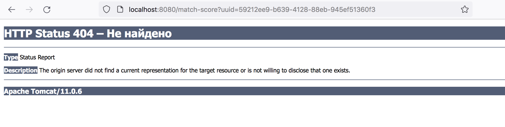
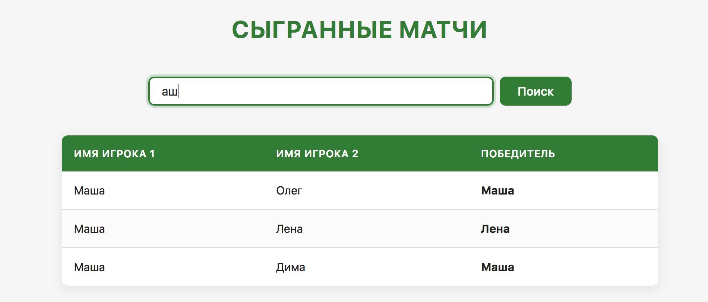
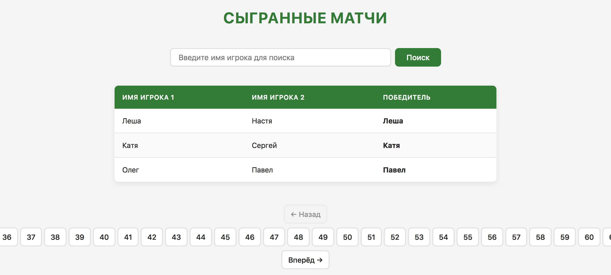

```text
Знаком ❗️ помечены критически важные замечания, а также места нарушения ТЗ.
```

## Функциональный обзор

- Реальные имена могут содержать дефисы, точки и апострофы — можно разрешить их использование.

- Сейчас ошибки валидации в каждом имени выводятся последовательно





Можно выводить сразу все ошибки валидации в обоих именах.

- Если приложение развёрнуто не в конрне сервера, то при создании матча пользователь видит сообщение об ошибке.



Стоит делать редирект с учётом контекстного пути.

- ❗️Нет кнопки сброса фильтра по имени игрока.



Нажатие на "Поиск" с пустой формой ввода тоже не сбрасывает фильтр. Сейчас он сбрасывается только если ввести в поле пробел.

- ❗️В пагинации на странице завершённых матчей отображаются все страницы, что плохо выглядит при большом количестве страниц и делает недоступными страницы за пределами экрана.



Лучше сделать отображение текущей и +-2 страниц вокруг неё.

